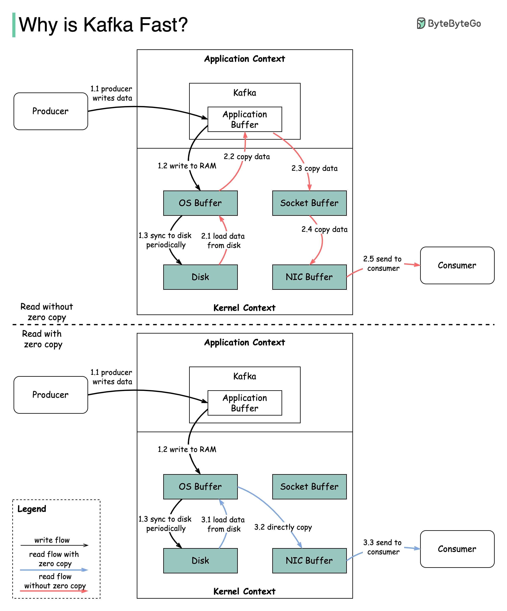

# Chapter 01. 카프카 시작하기

> **데이터를 이동시키는 작업에 더 적은 노력을 들일수록 핵심 비즈니스에 더욱 집중할 수 있다.**


## **1.1 발행/구독 메시지 전달 📌**

### **1.1.1 초기의 발행/구독 시스템**


### **1.1.2 개별 메시지 큐 시스템**

## **1.2 카프카 입문 📌**

### **1.2.1 메시지와 배치**

### **1.2.2 스키마와 데이터 직렬화**

### **1.2.3 토픽과 파티션**

### **1.2.4 프로듀서와 컨슈머**
- 카프카 클라이언트는 이 시스템의 사용자이며, 기본적으로 프로듀서와 컨슈머의 두 종류가 있음. 좀 더 고급 클라이언트(프로듀서와 컨슈머를 기본적인 요소로서 사용) API도 있음(Kafka Connect API, 카프카 스트림즈) 

cf) 제가 직접 겪은 프로그래머스 면접 기출 문제

- Kafka와 같은 메시징 기반 시스템 환경이 갖추어져 있고, 이 시스템을 이용해 모든 고객들에게 보너스 포인트를 지급하려고 합니다.
보너스 포인트 지급 대상이 메시지 시스템에 정상적으로 produce 된 상황임을 가정했을 때 아래 질문들에 대한 답변을 작성해주세요.
(정상적인 produce란 누락되는 것 없이 consumer가 처리하는데 필요한 충분한 데이 이 message에 포함되어 있음을 의미함)

```
1. 보너스 포인트 지급을 처리하는 Consumer에게 어떤 장애 포인트가 발생할 수 있을까요?

2. 보너스 포인트가 누탁되어서도 안되고, 중복 지급되어서도 안됩니다. Consumer를 어떻게 구현할 수 있을까요?
```

### **1.2.5 브로커와 클러스터**
- 카프카 서버를 브로커라고 부름
- [사실 및 원칙] 여러 개의 브로커 중 하나의 브로커가 클러스터 컨트롤러의 역할을 하게 됨(컨트롤러는 클러스터 안의 현재 작동 중인 브로커 중 하나가 자동으로 선정된다.) 

## **1.3 왜 카프카인가? 📌**

### **1.3.1 다중 프로듀서**
- 

### **1.3.2 다중 컨슈머**
- 1개의 메시지를 1개의 클라이언트에서 소비할 수 있는 기존의 queue 시스템과 달리, 카프카는 많은 컨슈머가 상호 간섭 없이 어떠한 메시지 스트림도 읽을 수 있도록 설계됨

### **1.3.3 디스크 기반 보존**
- 카프카 서버를 브로커라고 부름

### **1.3.4 확장성**
- 카프카 서버를 브로커라고 부름

### **1.3.5 고성능**

### <1> Sequential I/O (순차적 입출력)
- Kafka는 데이터를 디스크에 순차적으로 기록하며, 이는 디스크의 랜덤 입출력보다 훨씬 빠릅니다.
- 데이터를 파일에 순차적으로 쓰고 읽기 때문에 성능 저하가 적습니다

### <2> Zero Copy Principle (제로 복사 원칙)

데이터 전송 과정 요약

🔹 1단계 (1.1 - 1.3): 프로듀서가 데이터를 디스크에 기록
- 프로듀서가 데이터를 Kafka로 전송하면, Kafka는 데이터를 디스크에 순차적으로 기록합니다.

🔹 2단계: 제로 복사 없이 컨슈머가 데이터를 읽는 과정
- 2.1: 디스크에서 데이터가 OS 캐시로 로드됨
- 2.2: OS 캐시에서 Kafka 애플리케이션으로 데이터가 복사됨
- 2.3: Kafka 애플리케이션이 데이터를 소켓 버퍼로 복사함
- 2.4: 소켓 버퍼에서 데이터가 네트워크 카드로 복사됨
- 2.5: 네트워크 카드가 데이터를 컨슈머로 전송

🔹 최적화된 네트워크 전송
- 현대의 유닉스 운영체제는 **페이지 캐시(pagecache)**에서 데이터를 소켓으로 전송하는 과정을 최적화합니다.
- 리눅스에서는 이를 sendfile 시스템 호출을 통해 처리하며, 매우 효율적인 경로로 데이터 전송이 이루어집니다.

- https://blog.bytebytego.com/p/why-is-kafka-fast
- https://www.youtube.com/watch?v=UNUz1-msbOM
- https://kafka.apache.org/documentation/#maximizingefficiency  
- https://godofcheerup.tistory.com/110  # 1. 소켓은 파일이다 부분도 이해하는데 도움이 됨
- cache Layer 구조
- 관련성은 조금 떨어지나 redis는 왜 빠를까라는 주제도 연관지어서 같이 공부하면 좋을 것 같다는 생각이 듬

### <3> 공통 데이터 포맷 유지
- Kafka는 프로듀서, 브로커, 컨슈머 간에 동일한 메시지 포맷을 사용합니다.
- 브로커는 데이터를 변환하지 않고 그대로 저장하며, 이는 디스크 쓰기 및 네트워크 전송에서 추가적인 오버헤드를 줄입니다.

### <4> 분산 아키텍처
- Kafka는 데이터를 **토픽(topic)**으로 분산하고, 각 토픽은 **파티션(partition)**으로 나뉩니다.
- 여러 브로커에 분산된 데이터를 병렬로 처리하여 고속 데이터 처리가 가능합니다.

### <5> 데이터 압축 및 배치 전송
Kafka는 데이터를 압축하여 네트워크 트래픽을 줄이고, 여러 메시지를 한 번에 배치(batch)로 전송합니다.
이로 인해 브로커와 클라이언트 간의 효율적인 데이터 전송이 가능합니다.

### **1.3.6 플랫폼 기능**
- 

## **1.4 데이터 생태계 📌**

### **1.4.1 이용 사례**
- 활동 추적  # cf) https://f-lab.kr/insight/cqrs-event-sourcing-20240812?gad_source=1&gclid=Cj0KCQiAouG5BhDBARIsAOc08RTilju83ffQLm9cuMivqQMIGv6FTMt0FWf6agPGmECaEb1ppUj7WfgaAgVvEALw_wcB
- 메시지 교환
- 지표 및 로그 수집
- 커밋 로그  # CDC 가 생각남
- 스트림 처리

## **1.5 카프카의 기원📌**

### **1.5.1 링크드인이 직면한 문제**
-

### **1.5.2 카프카의 탄생**
- 

### **1.5.3 오픈소스**
- 

### **1.5.4 상업적 제품**
- 

### **1.5.5 이름**
- 카프카 이름은 프란츠 카프카에서 유래됨. 별다른 의도 없음

## **1.6 카프카 시작하기📌**